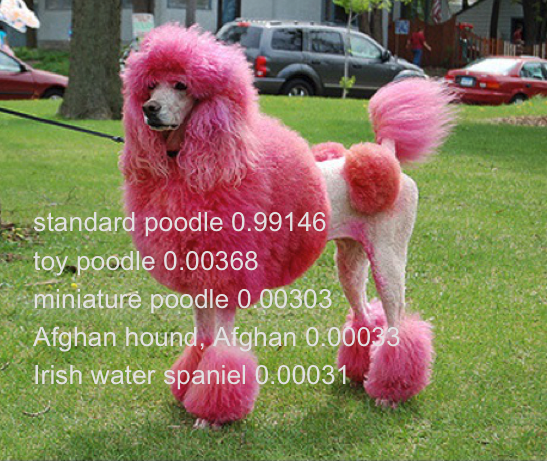
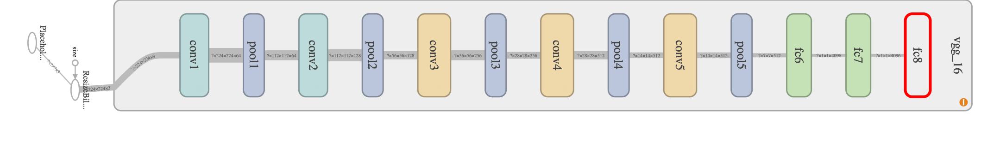
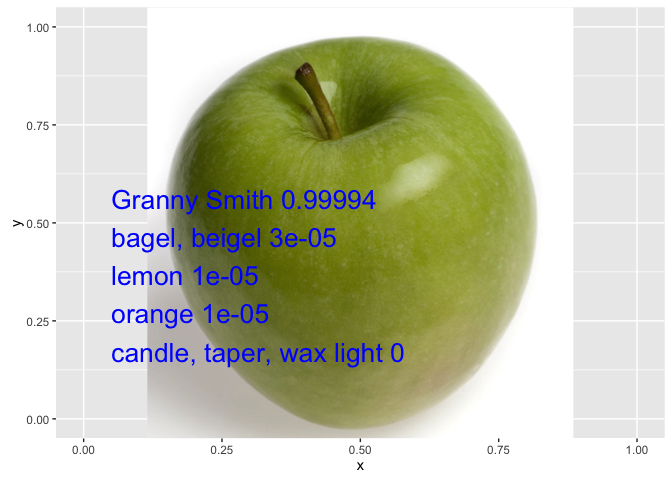

Image Classification in R using trained TensorFlow models
================
Oliver Dürr
11/7/2016

Note, this blog also appreared in <http://randomthoughtsonr.blogspot.ch/> and has been reposted in <https://www.r-bloggers.com/>

Recently RStudio has released a [package](https://rstudio.github.io/tensorflow/) that allows to use TensorFlow in R. Also recently several trained models for image classification have been [released](https://github.com/tensorflow/models/blob/master/slim/README.md#Pretrained). In this post I describe how to use the VGG16 model in R to produce an image classification like this:



(image taken from: <https://www.flickr.com/photos/jonner/487461265>)

The code is available on [github](https://github.com/oduerr/tf_r/tree/master/load_vgg16). In that directory there is also a python file [`load_vgg16.py`](https://github.com/oduerr/tf_r/tree/master/load_vgg16) for checking the validity of the R-code against the python implementation in which the models are published.

As a first step we download the VGG16 weights `vgg_16.tar.gz` from [here](https://github.com/tensorflow/models/blob/master/slim/README.md#Pretrained) and extract it. You should get a file named `vgg_16.ckpt` which we will need later.

Building the model
------------------

We now define the model. Note that since the network is written in the default graph, we do a clean start by resetting the default graph.

``` r
library(tensorflow)
slim = tf$contrib$slim #Poor mans import tensorflow.contrib.slim as slim
tf$reset_default_graph() # Better to start from scratch
```

We start with a placeholder [tensor](https://rstudio.github.io/tensorflow/using_tensorflow_api.html#tensor_shapes) in which we later feed the images. The model works on a batch of images and thus needs a tensor of order 4 (an array having 4 indices). The first index of the tensor counts the image number and the second to 4th index is for the width, height, color. Since we want to allow for an arbitrary number of images of arbitrary size, we leave these dimensions open. We only specify that there should be 3 color channels (rgb). Then these images are rescaled with TensorFlow to the size (224, 224) as needed by the network.

``` r
# Resizing the images
images = tf$placeholder(tf$float32, shape(NULL, NULL, NULL, 3))
imgs_scaled = tf$image$resize_images(images, shape(224,224))
```

We are now defining the VGG16 model. Luckily there is a package [TensorFlow-Slim](https://github.com/tensorflow/tensorflow/tree/master/tensorflow/contrib/slim) included in the TensorFlow installation, which allows to easily build networks.

``` r
# Definition of the network
library(magrittr) 
# The last layer is the fc8 Tensor holding the logits of the 1000 classes
fc8 = slim$conv2d(imgs_scaled, 64, shape(3,3), scope='vgg_16/conv1/conv1_1') %>% 
      slim$conv2d(64, shape(3,3), scope='vgg_16/conv1/conv1_2')  %>%
      slim$max_pool2d( shape(2, 2), scope='vgg_16/pool1')  %>%

      slim$conv2d(128, shape(3,3), scope='vgg_16/conv2/conv2_1')  %>%
      slim$conv2d(128, shape(3,3), scope='vgg_16/conv2/conv2_2')  %>%
      slim$max_pool2d( shape(2, 2), scope='vgg_16/pool2')  %>%

      slim$conv2d(256, shape(3,3), scope='vgg_16/conv3/conv3_1')  %>%
      slim$conv2d(256, shape(3,3), scope='vgg_16/conv3/conv3_2')  %>%
      slim$conv2d(256, shape(3,3), scope='vgg_16/conv3/conv3_3')  %>%
      slim$max_pool2d(shape(2, 2), scope='vgg_16/pool3')  %>%

      slim$conv2d(512, shape(3,3), scope='vgg_16/conv4/conv4_1')  %>%
      slim$conv2d(512, shape(3,3), scope='vgg_16/conv4/conv4_2')  %>%
      slim$conv2d(512, shape(3,3), scope='vgg_16/conv4/conv4_3')  %>%
      slim$max_pool2d(shape(2, 2), scope='vgg_16/pool4')  %>%

      slim$conv2d(512, shape(3,3), scope='vgg_16/conv5/conv5_1')  %>%
      slim$conv2d(512, shape(3,3), scope='vgg_16/conv5/conv5_2')  %>%
      slim$conv2d(512, shape(3,3), scope='vgg_16/conv5/conv5_3')  %>%
      slim$max_pool2d(shape(2, 2), scope='vgg_16/pool5')  %>%

      slim$conv2d(4096, shape(7, 7), padding='VALID', scope='vgg_16/fc6')  %>%
      slim$conv2d(4096, shape(1, 1), scope='vgg_16/fc7') %>% 

      # Setting the activation_fn=NULL does not work, so we get a ReLU
      slim$conv2d(1000, shape(1, 1), scope='vgg_16/fc8')  %>%
      tf$squeeze(shape(1, 2), name='vgg_16/fc8/squeezed')
```

We can visualize the model in tensorboard, by saving the default graph via:

``` r
tf$train$SummaryWriter('/tmp/dumm/vgg16', tf$get_default_graph())$close()
```

You can now open a shell and start tensorboard

``` bash
  tensorboard --logdir /tmp/dumm/
```

You should get a result like: 

Loading the weights
-------------------

We start a Session and restore the model weights from the downloaded weight file.

``` r
  restorer = tf$train$Saver()
  sess = tf$Session()
  restorer$restore(sess, '/Users/oli/Dropbox/server_sync/tf_slim_models/vgg_16.ckpt')
```

Loading the images
------------------

Now it's time to load the image. The values have to be in the range of 0 to 255. Therefore I multiply the values by 255. Further, we need to feed the placeholder Tensor with an array of order 4.

``` r
library(jpeg)
img1 <- readJPEG('apple.jpg')
d = dim(img1)
imgs = array(255*img1, dim = c(1, d[1], d[2], d[3])) #We need array of order 4
```

Feeding and fetching the graph
------------------------------

Now we have a graph in the session with the correct weights. We can do the predictions by feeding the placeholder tensor `images` with the value of the images stored in the array `imgs`. We fetch the `fc8` tensor from the graph and store it in `fc8_vals`.

``` r
fc8_vals = sess$run(fc8, dict(images = imgs))
fc8_vals[1:5] #In python [-2.86833096  0.7060132  -1.32027602 -0.61107934 -1.67312801]
```

    ## [1] 0.0000000 0.7053483 0.0000000 0.0000000 0.0000000

When comparing it with the python result, we see that negative values are clamped to zero. This is due to the fact that in this R implementation I could not deactivate the final ReLu operation. Nevertheless, we are only interested in the positive values which we transfer to probabilities for the certain classes via

``` r
probs = exp(fc8_vals)/sum(exp(fc8_vals))
```

We sort for the highest probabilities and also load the descriptions of the image net classes and produce the final plot.

``` r
idx = sort.int(fc8_vals, index.return = TRUE, decreasing = TRUE)$ix[1:5]

# Reading the class names
library(readr)
names = read_delim("imagenet_classes.txt", "\t", escape_double = FALSE, trim_ws = TRUE,col_names = FALSE)
```

    ## Parsed with column specification:
    ## cols(
    ##   X1 = col_character()
    ## )

``` r
### Graph
library(grid)
g = rasterGrob(img1, interpolate=TRUE) 
text = ""
for (id in idx) {
  text = paste0(text, names[id,][[1]], " ", round(probs[id],5), "\n") 
}

library(ggplot2)
ggplot(data.frame(d=1:3)) + annotation_custom(g) + 
  annotate('text',x=0.05,y=0.05,label=text, size=7, hjust = 0, vjust=0, color='blue') + xlim(0,1) + ylim(0,1) 
```



Now since we can load trained models, we can do many cool things like transfer learning etc.. More maybe another time...
