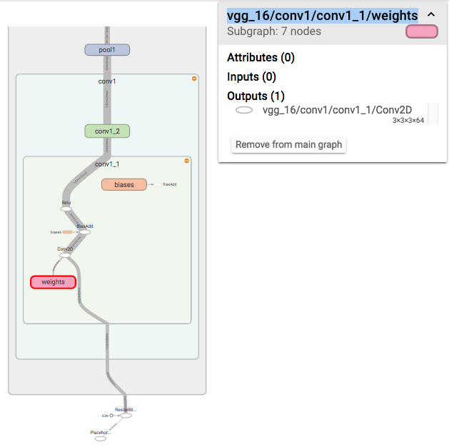

```{r setup, include=FALSE}
# Notes to create the blog post for R bloggers
#
# 1. Render as html document (output: html_document)
# 2. Open in Browser and copy&paste into the randomthoughts on R https://www.blogger.com/home 
# 3. Delete the images and replace them by links. I put them on dropbox://public/blog/...

# For my github site:

#output: html_document
#output: github_document
#output: word_document
knitr::opts_chunk$set(echo = TRUE)
```

## Model
In the last blog, you saw how one sets up a model. Now I will show you how to access the model. We don't really care where the model comes from, we just like to access the variables or feed and fetch tensors from the network. I now define a network as in the last blog.
```{r }
library(tensorflow)
slim = tf$contrib$slim #Poor mans import tensorflow.contrib.slim as slim
tf$reset_default_graph() # Better to start from scratch

# Resizing the images
images = tf$placeholder(tf$float32, shape(NULL, NULL, NULL, 3))
imgs_scaled = tf$image$resize_images(images, shape(224,224))

# Definition of the network
library(magrittr) 
# The last layer is the fc8 Tensor holding the logits of the 1000 classes
fc8 = slim$conv2d(imgs_scaled, 64, shape(3,3), scope='vgg_16/conv1/conv1_1') %>% 
      slim$conv2d(64, shape(3,3), scope='vgg_16/conv1/conv1_2')  %>%
      slim$max_pool2d( shape(2, 2), scope='vgg_16/pool1')  %>%

      slim$conv2d(128, shape(3,3), scope='vgg_16/conv2/conv2_1')  %>%
      slim$conv2d(128, shape(3,3), scope='vgg_16/conv2/conv2_2')  %>%
      slim$max_pool2d( shape(2, 2), scope='vgg_16/pool2')  %>%

      slim$conv2d(256, shape(3,3), scope='vgg_16/conv3/conv3_1')  %>%
      slim$conv2d(256, shape(3,3), scope='vgg_16/conv3/conv3_2')  %>%
      slim$conv2d(256, shape(3,3), scope='vgg_16/conv3/conv3_3')  %>%
      slim$max_pool2d(shape(2, 2), scope='vgg_16/pool3')  %>%

      slim$conv2d(512, shape(3,3), scope='vgg_16/conv4/conv4_1')  %>%
      slim$conv2d(512, shape(3,3), scope='vgg_16/conv4/conv4_2')  %>%
      slim$conv2d(512, shape(3,3), scope='vgg_16/conv4/conv4_3')  %>%
      slim$max_pool2d(shape(2, 2), scope='vgg_16/pool4')  %>%

      slim$conv2d(512, shape(3,3), scope='vgg_16/conv5/conv5_1')  %>%
      slim$conv2d(512, shape(3,3), scope='vgg_16/conv5/conv5_2')  %>%
      slim$conv2d(512, shape(3,3), scope='vgg_16/conv5/conv5_3')  %>%
      slim$max_pool2d(shape(2, 2), scope='vgg_16/pool5')  %>%

      slim$conv2d(4096, shape(7, 7), padding='VALID', scope='vgg_16/fc6')  %>%
      slim$conv2d(4096, shape(1, 1), scope='vgg_16/fc7') %>% 

      # Setting the activation_fn=NULL does not work, so we get a ReLU
      slim$conv2d(1000, shape(1, 1), scope='vgg_16/fc8')  %>%
      tf$squeeze(shape(1, 2), name='vgg_16/fc8/squeezed')
```

```{r}
  restorer = tf$train$Saver()
  sess = tf$Session()
  restorer$restore(sess, '/Users/oli/Dropbox/server_sync/tf_slim_models/vgg_16.ckpt')
```

## Accessing Variables 
If we don't have a pointer to the variable, we first have to get the variable via the name. 

### Finding the name of a variable
Say you want to look at the Kernels of the first convolutional layer. You can have a look at the tensorboard and find it there:
```{r, eval=FALSE}
    tf$train$SummaryWriter('/tmp/dumm/vgg16', tf$get_default_graph())$close()
    tensorboard --logdir /tmp/dumm/
```

The weights are an op and thus you want to get the first tensor which goes out of it, the one named `vgg16/conv1/conv1_1/weights:0`

Alternatively you can also loop over all `trainable_variable` or `all_variables` names
```{r}
for (v in tf$all_variables()[1:4]) {
  print(v$name)
}
```

## Accessing the variabel
Now that you have the name, you want to access the content of the variable. First we have you get the variable so far we only have the name. Note that calling `tf$get_variable('vgg_16/conv1/conv1_1/weights')` would create a new variable in the graph. See (stackoverflow)[http://stackoverflow.com/questions/35678883/tensorflow-getting-variable-by-name]. 

### By finding the correct variable
The easiest way would be
```{r}
  var = NULL
  for (v in tf$all_variables()) {
    if (v$name == 'vgg_16/conv1/conv1_1/weights:0') var = v
  }
  var$get_shape()
```
Let's have a look how the filter looks like:
```{r}
  var_val = sess$run(var)
  K = var_val[1,,,1]
```

```{r, fig.width=3, fig.width=3}
  library(grid)
  grid.raster(K - min(K) / (max(K)-min(K)), interpolate = FALSE)
```

### Variable Context 
An alternative way of accessing the variable is using the `tf$get_variable()` anyway. Usually `get_variable` will create a new variable. But if you consider the concept of a shared variable one can prevent `get_variable` from creating a new variable but returning an existing on. These shared variables are very usefull e.g. for Siamese Networks. I might cover them in a future blog, but in the meantime you can have a look at https://www.tensorflow.org/versions/master/how_tos/variable_scope/index.html. Here is the solution (a bit clumpsy in R):
```{r}
  with(tf$variable_scope('vgg_16/conv1/conv1_1', reuse=TRUE), {
        var1 = tf$get_variable(name="weights")
  })
```
And here a bit nicer in python:
```{python, eval=FALSE}
  with tf.variable_scope("", reuse=True):
    var = tf.get_variable("vgg_16/conv1/conv1_1/weights")
```

## Feeding and Fetching (seems not to work in R?)
```{r}
  #d = tf$Graph$get_tensor_by_name(tf$get_default_graph(), 'vgg_16/fc8/BiasAdd:0')
```


